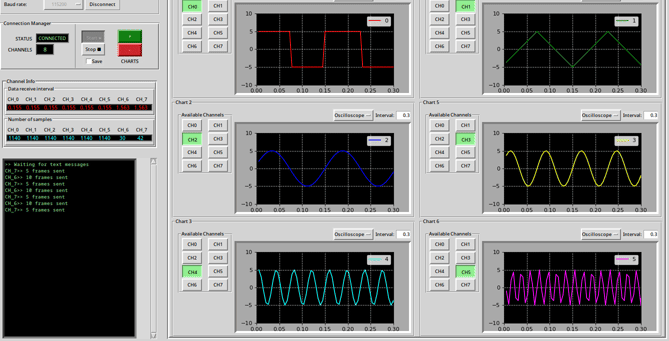

# A GUI for data transfer and visualization

Currently in test. Only tested with STM32F3 MCUs.

Visuvia uses [MCTP](https://github.com/blr-ophon/MCTP) protocol for communication through UART.




## Requirements

- tkinter
- matplotlib
- pyserial

## Usage

Clone the repository:

```bash
  git clone --recurse-submodules https://github.com/blr-ophon/visuvia
```


GUI mode: Allows data visualization in real time. 
```bash
  python main.py --gui 
```

CMD mode: saves received data to csv and text files.
```bash
  python main.py --cmd
```


## CMD commands

**sync**: Connect to microcontroller.  
**drop**: Disconnect from microcontroller.  
**request**: Start data transfer.  
**stop**: End data transfer. Save data to csv and text files.  
**exit**: Exit visuvia cmd.  
